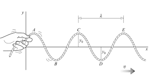

Reference: 
- https://www.toppr.com/guides/physics/waves/frequency-and-wavelength/
- https://qsstudy.com/explain-the-relation-between-frequency-and-time-period/

---

#### The relation between frequency, wavelength and wave speed:

- Both quantities are used to describe the characteristics of the wave, whether the lock is sound or light, which we can see in the image below.

     

- **Frequency** $f$ describes how often a wave arrives at a certain point, and it gets measured by Hertz (Hz) = $\frac{num of cycles}{t (sec/min/day)}$ , which describes as  the number of complete oscillations per unit time.
	- $f = 1/t$, $t$ is the period a wave takes to complete one Oscillation.
	- So as the number of cycles increases, the time it takes to complete one cycle decreases, so they are _Inversely proportional_
- **Wavelength** $\lambda$ is the measure of two similar nearest points in the wave, and it gets measured by the distance.
- **Wave speed** $v$ = $f \times \lambda$
	- Since the speed of light is constant, then the longer the wavelength $\lambda$ the smaller is the frequency $f$. However it does change through different mediums. (not sure how will this work in space, will need to ask Prof). I would assume that in space the speed of light does not get effected.
-  Frequencies]] does not change through a ***medium***, but the wavelength does, but why ?
	-  Giving this equation $v = f \times \lambda$, it shows that the $v \propto \lambda$.
	- Therefore, going through a thicker medium, the speed will be slower and the wavelength will be shorter leaving the frequency unchanged. meaning Both $v$ and $\lambda$ will decrease leaving the frequency **_unchanged_**.