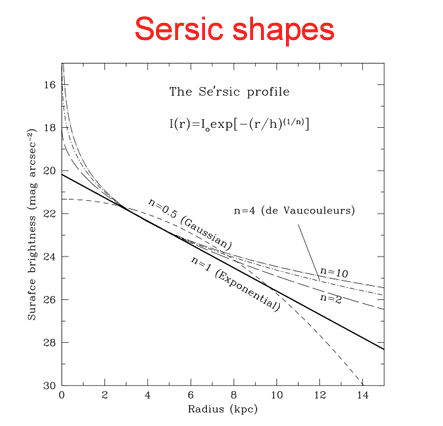
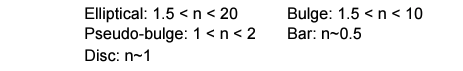

Reference:
- http://www-star.st-and.ac.uk/~spd3/Teaching/AS3011/AS3011_5.pdf

---
#### What is the sersic profile used for:
- It describes how surface brightness decreases relative to the radius.
- The simplest form is when $n = 1$, where $n$ is the sersic index, where it changes depending on the structure.

     

#### The Sersic profile equation $$I(r)=I_{0}\exp(-(\frac{r}{\alpha})^{1/n})$$ where:
- $I(r)$ = intensity at radius r ~ (total light profile ?)
- $I_0$ = central intensity
- $\alpha$ = scale length (what ever that is)
- n = Sersic index, where the index is based on the structure.

     

